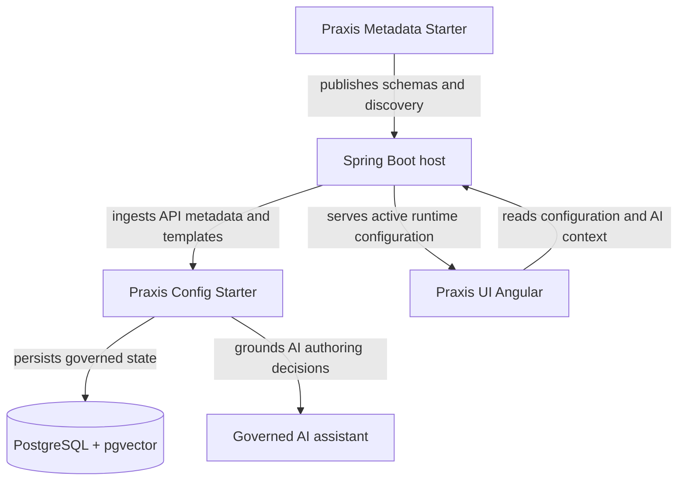

# Praxis Config Starter

[](https://central.sonatype.com/artifact/io.github.codexrodrigues/praxis-config-starter)


[](LICENSE)

`praxis-config-starter` is the canonical configuration boundary for Praxis Platform Spring Boot hosts.

It owns persistence and runtime semantics for:

- `ui_user_config`: tenant, user, environment, version, ETag, and JSON configuration state.
- `ai_registry`: governed component definitions, templates, and executable authoring manifests.
- `api_metadata`: ingested API catalog metadata used for search and AI grounding.
- `/api/praxis/config/**`: configuration, registry, AI context, authoring, stream, and domain-decision APIs.
- AI provider orchestration, RAG/project-knowledge retrieval, signed stream access, and governed authoring diagnostics.

`praxis-config-starter` does not define backend resource semantics. That belongs to
[`praxis-metadata-starter`](https://github.com/codexrodrigues/praxis-metadata-starter).
It also does not render UI. Runtime rendering belongs to
[`praxis-ui-angular`](https://github.com/codexrodrigues/praxis-ui-angular).

## Architecture



## When To Use It

Use this starter when a Spring Boot host needs:

- remote configuration for Praxis UI components;
- tenant/user scoped settings with ETag-aware reads;
- a governed AI registry for component templates and authoring manifests;
- API catalog ingestion for AI grounding and retrieval;
- AI provider routing for OpenAI, Gemini, xAI-compatible OpenAI APIs, and mock mode;
- Server-Sent Events for browser-compatible AI authoring streams;
- governed domain-rule and domain-knowledge change workflows.

Do not use it as a replacement for the resource/schema contract published by `praxis-metadata-starter`.

## Installation

Add the dependency to the consuming Spring Boot host and use the latest version from Maven Central.

```xml
<dependency>
    <groupId>io.github.codexrodrigues</groupId>
    <artifactId>praxis-config-starter</artifactId>
    <version>${praxis.config.version}</version>
</dependency>
```

Minimum runtime expectations:

- Java 17+
- Spring Boot 3.5+
- PostgreSQL 14+
- `pgvector` when vector search/RAG is enabled

## Minimal Configuration

```yaml
spring:
  datasource:
    url: ${PRAXIS_DB_URL}
    username: ${PRAXIS_DB_USERNAME}
    password: ${PRAXIS_DB_PASSWORD}
  jpa:
    hibernate:
      ddl-auto: none
  flyway:
    locations: classpath:db/migration
    baseline-on-migrate: true

praxis:
  ai:
    api-key:
      encryption-key: ${PRAXIS_AI_API_KEY_ENCRYPTION_KEY}
    keys:
      admin-token: ${PRAXIS_AI_KEYS_ADMIN_TOKEN}
      require-admin-token: true
    stream:
      auth:
        mode: cookie
```

For clean installations that should not replay the historical migration chain, use the squashed baseline:

```properties
spring.flyway.locations=classpath:db/baseline
```

## AI Provider Configuration

Provider credentials must come from environment variables or host-owned secret management.
Do not commit real API keys.

```yaml
spring:
  ai:
    openai:
      api-key: ${PRAXIS_AI_OPENAI_API_KEY:${OPENAI_API_KEY:}}
      base-url: ${PRAXIS_AI_OPENAI_BASE_URL:https://api.openai.com}
      chat:
        options:
          model: ${PRAXIS_AI_OPENAI_MODEL:gpt-4o-mini}
    google:
      genai:
        api-key: ${PRAXIS_AI_GEMINI_API_KEY:${GEMINI_API_KEY:}}
        chat:
          options:
            model: ${PRAXIS_AI_GEMINI_MODEL:gemini-2.5-flash}

praxis:
  ai:
    provider: ${PRAXIS_AI_PROVIDER:mock}
    embedding:
      provider: ${PRAXIS_AI_EMBEDDING_PROVIDER:mock}
```

For local browser `EventSource` flows where custom request headers cannot be attached, configure
signed stream URLs in the host and provide a stable local token secret:

```properties
praxis.ai.stream.auth.mode=signed-url-token
praxis.ai.stream.auth.token-secret=${PRAXIS_AI_STREAM_AUTH_TOKEN_SECRET}
```

Use a production-grade secret in deployed environments and rotate it through the host's normal secret process.

## Key HTTP Surfaces

| Surface | Purpose |
| --- | --- |
| `/api/praxis/config/ui` | Read, write, and delete tenant/user scoped UI configuration. |
| `/api/praxis/config/api-catalog/**` | Ingest and search API metadata for grounding and retrieval. |
| `/api/praxis/config/ai-registry/**` | Manage component definitions, templates, and authoring manifest projections. |
| `/api/praxis/config/ai-context/**` | Build AI context from component metadata, runtime state, templates, and schema hints. |
| `/api/praxis/config/ai/patch` | Generate structured configuration patches from governed AI context. |
| `/api/praxis/config/ai/authoring/**` | Validate, compile, preview, apply, stream, replay, and cancel agentic authoring turns. |
| `/api/praxis/config/domain-rules/**` | Govern shared business rules and semantic decisions before publishing materializations. |
| `/api/praxis/config/domain-knowledge/**` | Govern domain knowledge change sets and evidence lifecycle. |

## Documentation

Start with these repository documents:

- [AI contract docs](docs/ai/contracts/README.md)
- [Agentic authoring streaming](docs/ai/agentic-authoring-streaming.md)
- [Memory and PII guidance](docs/ai/memory-and-pii.md)
- [Runtime enforcement release checklist](docs/ai/runtime-enforcement-consumer-release-checklist-2026-05-02.md)
- [Domain catalog contract](docs/domain-catalog/domain-catalog-contract-v0.2.md)
- [Release process](RELEASING.md)

The public operational host for end-to-end validation is
[`praxis-api-quickstart`](https://github.com/codexrodrigues/praxis-api-quickstart).

## Development

Run the starter smoke profile:

```powershell
mvn -B -P ci-smoke-unit -T 1C clean verify
```

For changes that affect AI authoring, streaming, release gates, or quickstart integration, run the downstream smoke described in [RELEASING.md](RELEASING.md) and the workflow `.github/workflows/agentic-authoring-smoke.yml`.

Local AI credential files such as `.env.openai.local.ps1` are intentionally ignored by Git. Keep real provider keys out of commits and rotate any key that was copied outside the local development environment.

## License

Apache License 2.0. See [LICENSE](LICENSE).
