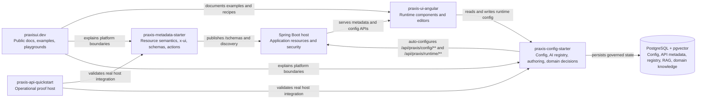
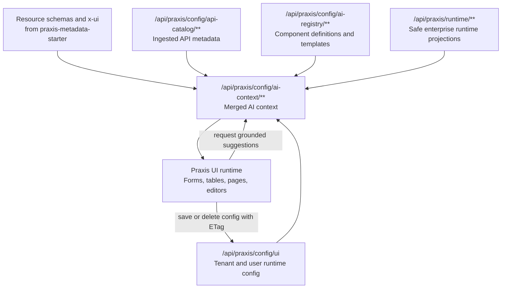
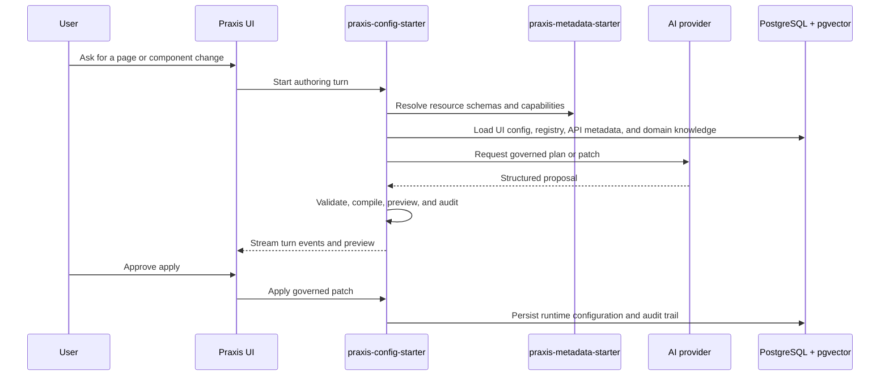

# Praxis Config Starter

[](https://central.sonatype.com/artifact/io.github.codexrodrigues/praxis-config-starter)


[](LICENSE)

`praxis-config-starter` is the canonical configuration boundary for Praxis Platform Spring Boot hosts.

It owns persistence and runtime semantics for:

- `ui_user_config`: tenant, user, environment, version, ETag, and JSON configuration state.
- `ai_registry`: governed component definitions, templates, and executable authoring manifests.
- `api_metadata`: ingested API catalog metadata used for search and AI grounding.
- `/api/praxis/config/**`: configuration, registry, AI context, authoring, stream, and domain-decision APIs.
- `/api/praxis/runtime/context`, `/api/praxis/runtime/tenants`, `/api/praxis/runtime/navigation`, context switches, and security/runtime events: safe enterprise runtime projections for corporate shells and AI grounding.
- AI provider orchestration, RAG/project-knowledge retrieval, signed stream access, and governed authoring diagnostics.

`praxis-config-starter` does not define backend resource semantics. That belongs to
[`praxis-metadata-starter`](https://github.com/codexrodrigues/praxis-metadata-starter).
It also does not render UI. Runtime rendering belongs to
[`praxis-ui-angular`](https://github.com/codexrodrigues/praxis-ui-angular).
The public Praxis UI site, examples, and documentation are available at
[praxisui.dev](https://praxisui.dev/).

## Source Of Truth Boundaries

| Concern | Canonical owner |
| --- | --- |
| Backend resource semantics, `x-ui`, `/schemas/filtered`, discovery, and capabilities | [`praxis-metadata-starter`](https://github.com/codexrodrigues/praxis-metadata-starter) |
| Runtime configuration, enterprise context projection, AI registry, API metadata, templates, stream auth, and governed authoring state | `praxis-config-starter` |
| Angular runtime rendering, materializers, editors, and host integration APIs | [`praxis-ui-angular`](https://github.com/codexrodrigues/praxis-ui-angular) |
| Public site, examples, playgrounds, and platform documentation | [praxisui.dev](https://praxisui.dev/) |
| Public operational proof and downstream HTTP validation | [`praxis-api-quickstart`](https://github.com/codexrodrigues/praxis-api-quickstart) |

The classpath AI registry snapshot at `src/main/resources/ai-registry/registry-snapshot.json`
is a derived bootstrap artifact. Its canonical publication input is
`praxis-ui-angular/dist/praxis-component-registry-ingestion.json`; release cuts must regenerate and
validate the Angular corpus first, copy that artifact into the starter, and let
`AiRegistrySnapshotContractTest` lock the resulting hash, release identity, manifest coverage, and
chunk counts.

Assisted repository exploration is available through [CodeWiki](https://codewiki.google/github.com/codexrodrigues/praxis-config-starter/).
CodeWiki is complementary navigation for code reading; the repository docs and source remain normative.

## Relationship With Praxis Metadata Starter

`praxis-metadata-starter` and `praxis-config-starter` are complementary backend starters, not substitutes.

`praxis-metadata-starter` is the canonical source for resource-oriented metadata:

- resource keys and resource controllers;
- `x-ui` vocabulary and schema annotations;
- `/schemas/filtered` structural schema output;
- resource surfaces, actions, and capabilities discovery;
- the operation/schema resolution model consumed by Praxis UI runtimes and hosts.

`praxis-config-starter` consumes and enriches that metadata boundary with governed runtime state:

- persisted UI configuration per tenant, environment, user, resource, and component;
- safe enterprise runtime context projection for corporate shells and AI grounding;
- API metadata ingestion used by search, RAG, and AI authoring context;
- AI registry definitions, authoring manifests, templates, and diagnostics;
- signed or cookie-based stream access for browser-compatible authoring flows;
- governed domain decisions and materialization workflows under `/api/praxis/config/**`.

In a typical host, `praxis-metadata-starter` explains what backend resources are and which UI/schema capabilities they expose. `praxis-config-starter` stores how a tenant or user configures those capabilities, how AI tools reason over them, and how governed authoring changes are validated before they become runtime configuration.

When the two starters disagree, treat `praxis-metadata-starter` as authoritative for resource/schema semantics and `praxis-config-starter` as authoritative for configuration, AI, authoring, and persistence semantics. Public examples and guides on [praxisui.dev](https://praxisui.dev/) should reflect both boundaries without redefining either one.

## How It Fits

`praxis-config-starter` sits between backend metadata, UI runtime, persistent configuration, and governed AI authoring. It does not replace the metadata starter or the Angular runtime; it gives hosts a canonical place to store runtime configuration and govern how AI-assisted changes become configuration.


```mermaid
flowchart LR
    metadata["praxis-metadata-starter<br/>Resource semantics, x-ui, schemas, actions"]
    host["Spring Boot host<br/>Application resources and security"]
    config["praxis-config-starter<br/>Config, AI registry, authoring, domain decisions"]
    db[("PostgreSQL + pgvector<br/>Config, API metadata, registry, RAG, domain knowledge")]
    angular["praxis-ui-angular<br/>Runtime components and editors"]
    site["praxisui.dev<br/>Public docs, examples, playgrounds"]
    quickstart["praxis-api-quickstart<br/>Operational proof host"]

    metadata -->|"publishes /schemas and discovery"| host
    config -->|"auto-configures /api/praxis/config/** and /api/praxis/runtime/**"| host
    host -->|"serves metadata and config APIs"| angular
    angular -->|"reads and writes runtime config"| config
    config -->|"persists governed state"| db
    site -->|"documents examples and recipes"| angular
    site -->|"explains platform boundaries"| metadata
    site -->|"explains platform boundaries"| config
    quickstart -->|"validates real host integration"| metadata
    quickstart -->|"validates real host integration"| config
```


```mermaid
flowchart TD
    schemas["Resource schemas and x-ui<br/>from praxis-metadata-starter"]
    apiCatalog["/api/praxis/config/api-catalog/**<br/>Ingested API metadata"]
    registry["/api/praxis/config/ai-registry/**<br/>Component definitions and templates"]
    uiConfig["/api/praxis/config/ui<br/>Tenant and user runtime config"]
    runtimeContext["/api/praxis/runtime/**<br/>Safe enterprise runtime projections"]
    context["/api/praxis/config/ai-context/**<br/>Merged AI context"]
    runtime["Praxis UI runtime<br/>Forms, tables, pages, editors"]

    schemas --> context
    apiCatalog --> context
    registry --> context
    uiConfig --> context
    runtimeContext --> context
    context --> runtime
    runtime -->|"save or delete config with ETag"| uiConfig
    runtime -->|"request grounded suggestions"| context
```


```mermaid
sequenceDiagram
    participant User
    participant UI as Praxis UI
    participant Config as praxis-config-starter
    participant Metadata as praxis-metadata-starter
    participant AI as AI provider
    participant DB as PostgreSQL + pgvector

    User->>UI: Ask for a page or component change
    UI->>Config: Start authoring turn
    Config->>Metadata: Resolve resource schemas and capabilities
    Config->>DB: Load UI config, registry, API metadata, and domain knowledge
    Config->>AI: Request governed plan or patch
    AI-->>Config: Structured proposal
    Config->>Config: Validate, compile, preview, and audit
    Config-->>UI: Stream turn events and preview
    User->>UI: Approve apply
    UI->>Config: Apply governed patch
    Config->>DB: Persist runtime configuration and audit trail
```

## When To Use It

Use this starter when a Spring Boot host needs:

- remote configuration for Praxis UI components;
- tenant/user scoped settings with ETag-aware reads;
- a governed AI registry for component templates and authoring manifests;
- API catalog ingestion for AI grounding and retrieval;
- AI provider routing for OpenAI, Gemini, xAI-compatible OpenAI APIs, and mock mode;
- Server-Sent Events for browser-compatible AI authoring streams;
- governed domain-rule and domain-knowledge change workflows.

Do not use it as a replacement for the resource/schema contract published by `praxis-metadata-starter`.

## Installation

Add the dependency to the consuming Spring Boot host and use the latest version from Maven Central.

```xml
<dependency>
    <groupId>io.github.codexrodrigues</groupId>
    <artifactId>praxis-config-starter</artifactId>
    <version>${praxis.config.version}</version>
</dependency>
```

Minimum runtime expectations:

- Java 21+ (required by the canonical `praxis-rules-engine` snapshot contract)
- Spring Boot 3.5+
- PostgreSQL 14+
- `pgvector` when vector search/RAG is enabled

Hosts that publish Java-backed RuleSet snapshots must provide a
`DomainRuleImplementationCatalog`. The default is deny-all. The catalog is an
external supply-chain capability scoped by tenant, environment and owner host;
it must never be derived from the snapshot being published. Customer Java
extensions additionally require the signed/allowlisted `RuleExtensionTrust`
contract from `praxis-rules-engine` `1.3`. See
[Rule snapshot control plane v1](docs/domain-rules/snapshot-control-plane-v1.md).

## Minimal Configuration

```yaml
spring:
  datasource:
    url: ${PRAXIS_DB_URL}
    username: ${PRAXIS_DB_USERNAME}
    password: ${PRAXIS_DB_PASSWORD}
  jpa:
    hibernate:
      ddl-auto: none
  flyway:
    locations: classpath:db/migration
    baseline-on-migrate: true

praxis:
  ai:
    api-key:
      encryption-key: ${PRAXIS_AI_API_KEY_ENCRYPTION_KEY}
    keys:
      admin-token: ${PRAXIS_AI_KEYS_ADMIN_TOKEN}
      require-admin-token: true
    stream:
      auth:
        mode: cookie
```

The squashed baseline is a limited bootstrap convenience for the compact
configuration, API metadata, UI registry and RuleSet snapshot-store surfaces it
explicitly declares. It is not a complete clean-install schema for every
Config Starter capability. In particular, governed rule definitions,
materializations, domain knowledge, federation and later AI authoring stores
still require `classpath:db/migration` (or a separately verified, host-owned
full baseline). This includes IAM-bound definition approvals introduced by V36;
the reduced baseline alone cannot publish governed snapshots from definitions.

Use the limited squashed baseline only when the host has verified that it needs
no tables outside that declared subset:

```properties
spring.flyway.locations=classpath:db/baseline
```

## AI Provider Configuration

Provider credentials must come from environment variables or host-owned secret management.
Do not commit real API keys.

```yaml
spring:
  ai:
    openai:
      api-key: ${PRAXIS_AI_OPENAI_API_KEY:${OPENAI_API_KEY:}}
      base-url: ${PRAXIS_AI_OPENAI_BASE_URL:https://api.openai.com}
      chat:
        options:
          model: ${PRAXIS_AI_OPENAI_MODEL:gpt-4o-mini}
    google:
      genai:
        api-key: ${PRAXIS_AI_GEMINI_API_KEY:${GEMINI_API_KEY:}}
        chat:
          options:
            model: ${PRAXIS_AI_GEMINI_MODEL:gemini-2.5-flash}

praxis:
  ai:
    provider: ${PRAXIS_AI_PROVIDER:mock}
    embedding:
      provider: ${PRAXIS_AI_EMBEDDING_PROVIDER:mock}
```

For local browser `EventSource` flows where custom request headers cannot be attached, configure
signed stream URLs in the host and provide a stable local token secret:

```properties
praxis.ai.stream.auth.mode=signed-url-token
praxis.ai.stream.auth.token-secret=${PRAXIS_AI_STREAM_AUTH_TOKEN_SECRET}
```

Use a production-grade secret in deployed environments and rotate it through the host's normal secret process.

## Authoring Cache Configuration

Agentic authoring keeps short-lived caches only for host-local performance. These caches must not be treated as a
source of truth: `ai_registry`, `api_metadata`, runtime metadata and persisted turn events remain canonical.

| Property | Default | Notes |
| --- | --- | --- |
| `praxis.ai.authoring.legacy-keyword-fallback-enabled` | `false` | Compatibility switch for old deterministic keyword intent fallback. Keep disabled in canonical hosts; enable only for legacy smoke/test fixtures while migrating to semantic intent resolution. |
| `praxis.ai.authoring.component-capabilities.cache-ttl-ms` | `60000` | TTL for component capability discovery. Use `0` to disable local caching when validating registry changes without restarting the host. |
| `praxis.ai.authoring.consultative.api-catalog.compact-cache-ttl-ms` | `60000` | TTL for compact API catalog projections used during consultative answers. Use `0` to force fresh projection per request. |
| `praxis.ai.authoring.consultative.api-catalog.compact-cache-max-entries` | `256` | Maximum compact projection entries retained per starter instance. Older entries are evicted before expired entries can accumulate unbounded. |
| `praxis.ai.authoring.consultative.api-catalog.api-metadata-cache-ttl-ms` | `60000` | TTL for `api_metadata` lookups used by the consultative catalog projection. Use `0` when validating metadata ingestion changes interactively. |
| `praxis.api-metadata.rag-publication.enabled` | `true` | Enables after-commit publication of derived API metadata RAG documents. Disable only when the structured `api_metadata` corpus must persist without vector indexing. |

## UI Config Identity Semantics

`/api/praxis/config/ui` normalizes logical identity at the service boundary before lookup, upsert
or delete. `tenantId`, `componentType` and `componentId` are trimmed and required; `X-User-ID`,
`X-Env` and `X-Updated-By` are trimmed and blank values are treated as absent. A blank environment
therefore targets the global environment scope (`environment IS NULL`) instead of creating a distinct
empty-string scope.

Identity values are validated against the `ui_user_config` schema before repository or PostgreSQL
atomic-upsert paths run: tenant, user, updater and component id are limited to 255 characters;
component type and environment are limited to 64 characters. Invalid identity input returns a
deterministic `400 Bad Request` response. `scope=user` still requires a nonblank `X-User-ID`; tenant
scope ignores user identity for persistence.

## UI Config Conditional Requests

`/api/praxis/config/ui` publishes HTTP ETag semantics for cached reads and guarded writes. GET
responses expose the current entity tag in the `ETag` header and response body. Clients may send
`If-None-Match` with `*`, a quoted entity tag, a weak quoted entity tag, or a comma-separated list
of quoted validators. When any validator weakly matches the current configuration ETag, the read
returns `304 Not Modified` with the current `ETag`.

PUT and DELETE accept `If-Match` with `*` or a comma-separated list of quoted entity tags. Wildcard
requires that the targeted configuration already exists; missing targets still return `412
Precondition Failed`. Strong validators must match the current ETag before the mutation proceeds;
weak validators are syntactically accepted but do not satisfy `If-Match`. Malformed conditional
headers, including unquoted raw tokens, return `400 Bad Request`.

## AI Registry Revision Semantics

`ai_registry.version` and `ai_registry.etag` are internal freshness tokens for governed registry
records. Inserts start at `version=1` with a generated `etag`. Component definitions, templates and
snapshot metadata increment `version` and rotate `etag` only when persisted material state changes:
payload, embedding, tags, source, source reference or status. Reingesting identical material keeps
the stable registry identity tuple and preserves both tokens.

These fields are not exposed as public HTTP conditional request semantics for
`/api/praxis/config/ai-registry/**` in this release. HTTP ETag behavior remains owned by the
surfaces that explicitly publish it, such as `ui_user_config`.

## API Metadata Scope Semantics

`api_metadata` is the canonical structured API grounding corpus persisted by the config starter.
Its identity is scoped by tenant, environment, service key, release id, path and method. Ingestion
reconciles moved endpoints by `operationId` only inside that same scope, so one tenant, environment
or release cannot overwrite another structured API corpus.

The API RAG/vector document remains a derived retrieval projection over this structured source. RAG
metadata carries the same tenant, environment and release identity for deterministic replay and
cleanup, but it must not become the authority for schemas, endpoints or business resource semantics.
Scoped API candidate retrieval fails closed when no tenant/environment result is available; it must
not retry against an unscoped corpus that could include another tenant's API evidence.

The official Quickstart authoring smoke bootstraps its own scoped `api_metadata` evidence from the
Quickstart OpenAPI before resolving intent. The bootstrap includes the minimum cross-domain corpus
used by the complete suite, rather than only the first scenario, so later authoring decisions remain
grounded and compete against the same reproducible evidence. This keeps the release proof valid on an
empty database and exercises the canonical ingestion endpoint instead of relying on manually seeded rows.

For a resolved canonical create-form intent, both `/minimal-form-plan` and `/page-preview` retrieve the
selected `/schemas/filtered` request schema and materialize fields deterministically. If that schema is
unavailable, planning fails closed; an LLM response must not substitute invented host fields.

API catalog ingestion persists the canonical `api_metadata` rows before publishing the derived RAG
corpus. RAG publication is scheduled after the database commit and can be replayed from canonical
rows with `POST /api/praxis/config/api-catalog/rag/reconcile?releaseId=...`; operators can inspect
readiness with `GET /api/praxis/config/api-catalog/rag/status?releaseId=...`. A vector-store outage
or publication failure must not roll back canonical ingestion, and RAG diagnostics should be used to
decide whether semantic retrieval is operational for that scope.

API metadata `tags` filters are normalized as comma, semicolon or pipe separated tokens and matched
case-insensitively as an AND set. Structured retrieval and RAG retrieval must both preserve method,
tenant, environment and release filters; when RAG is available, nonmatching tagged candidates are
discarded instead of falling back to a legacy or unscoped corpus.

## Key HTTP Surfaces

| Surface | Purpose |
| --- | --- |
| `/api/praxis/config/ui` | Read, write, and delete tenant/user scoped UI configuration. Hosts can register `UiConfigWriteAuthorizer` to authorize governed writes from server-side identity and capability policy. |
| `/api/praxis/config/api-catalog/**` | Ingest and search API metadata for grounding and retrieval. |
| `/api/praxis/config/ai-registry/**` | Manage component definitions, templates, and authoring manifest projections. |
| `/api/praxis/config/ai-context/**` | Build AI context from component metadata, runtime state, templates, and schema hints. |
| `/api/praxis/config/ai/patch` | Generate structured configuration patches from governed AI context. |
| `/api/praxis/config/ai/authoring/**` | Validate, compile, preview, apply, stream, replay, and cancel agentic authoring turns. |
| `/api/praxis/config/domain-rules/**` | Govern shared business rules and semantic decisions, including immutable RuleSet snapshots, conditional head publication and rollback-by-selection. |
| `GET /api/praxis/config/domain-rules/snapshots/head/status` | Expose safe readiness and the concurrency ETag for a scoped RuleSet head, including governed recovery of preserved pre-manifest beta snapshots without returning unverified content. |
| `/api/praxis/config/domain-knowledge/**` | Govern domain knowledge change sets and evidence lifecycle. |
| `GET /api/praxis/runtime/context` | Return a safe, host-neutral enterprise runtime context projection. Private auth and authorization internals remain host-owned. |
| `PUT /api/praxis/runtime/context` | Request a host-authorized context switch. The response returns the effective context and safe propagation headers; the default provider never switches to a different tenant without a host-owned provider. |
| `GET /api/praxis/runtime/tenants` | Return host-provided accessible tenant/company choices for corporate shells. The default provider exposes only the active tenant and never private entitlement internals. |
| `GET /api/praxis/runtime/navigation` | Return host-provided navigation nodes for corporate shells, with optional canonical Praxis refs such as `resourceKey`, `surfaceRef`, `actionRef`, `moduleKey`, and `capabilityRef`. The default provider returns an empty safe tree. |
| `GET /api/praxis/runtime/security-events` | Return host-provided safe runtime/security signals for corporate shells. The default provider returns an empty safe list and never exposes raw roles, policies, tokens, prompts, SQL or private audit internals. |

## Documentation

Start with these repository documents:

- [AI contract docs](docs/ai/contracts/README.md)
- [Agentic authoring streaming](docs/ai/agentic-authoring-streaming.md)
- [Memory and PII guidance](docs/ai/memory-and-pii.md)
- [Rule snapshot control plane v1](docs/domain-rules/snapshot-control-plane-v1.md)

RuleSet publication is a governed maker-checker flow: first request
`POST /api/praxis/config/domain-rules/snapshots/composition-manifest`, obtain two
segregated approvals by having each authenticated approver call
`POST /api/praxis/config/domain-rules/snapshots/composition-approvals`, then have
a different authenticated publisher submit the unchanged candidate with that
digest. In corporate mode the host must map the IAM roles
`RULE_DEFINITION_AUTHOR`, `RULE_DEFINITION_APPROVER`,
`RULE_COMPOSITION_APPROVER`, `RULE_SNAPSHOT_PUBLISHER` and
`RULE_SNAPSHOT_OPERATOR`; actor names sent in request bodies are not accepted.
Definition approval is append-only, rejects self-approval and is tied to the
exact canonical definition hash. The Config Starter rejects source, composition
or catalog drift and never treats
caller-declared Java coordinates as an admission catalog.
- [Runtime enforcement release checklist](docs/ai/runtime-enforcement-consumer-release-checklist-2026-05-02.md)
- [Domain catalog contract](docs/domain-catalog/domain-catalog-contract-v0.2.md)
- [Release process](RELEASING.md)

The public operational host for end-to-end validation is
[`praxis-api-quickstart`](https://github.com/codexrodrigues/praxis-api-quickstart).

## Development

Run the starter smoke profile:

```powershell
mvn -B -P ci-smoke-unit -T 1C clean verify
```

For changes that affect AI authoring, streaming, release gates, or quickstart integration, run the downstream smoke described in [RELEASING.md](RELEASING.md) and the workflow `.github/workflows/agentic-authoring-smoke.yml`.

Local AI credential files such as `.env.openai.local.ps1` are intentionally ignored by Git. Keep real provider keys out of commits and rotate any key that was copied outside the local development environment.

## License

Apache License 2.0. See [LICENSE](LICENSE).
