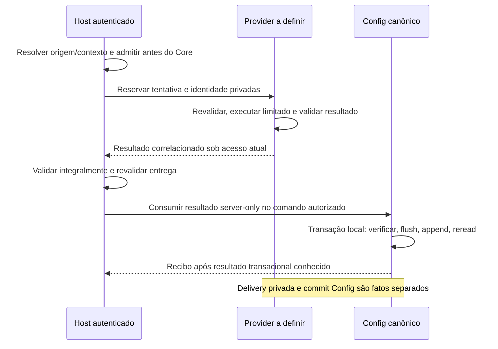

# Fronteira proposta de execução e reconciliação de comandos — 6s

> **Replanejamento vigente — 2026-10-05:** o usuário confirmou que as libs de UI
> não devem ser executadas no backend. B2d/executor e DEC-01..04 deixam de ser
> dependências deste fluxo. O texto abaixo conserva o checkpoint anterior;
> propostas de execução externa estão superadas. Requisitos independentes de
> integridade, autoridade e reconciliação precisam ser avaliados separadamente.
> Ver [decisão e próximo pacote](../../../../praxis-api-quickstart/docs/ui-layout-frontend-baseline-decision.md).

Adendo de inventário, 2026-10-05: lookup autorizado de criação por chave e contexto
cooperativo B2c2 já estão implementados. O restante do protocolo externo continua
proposto, com DEC-01..04 pendentes. Consulte
[readiness B2d](ui-layout-execution-b2d-readiness.md) para a fronteira atual.

2026-10-03. **PROPOSTA arquitetural privada, sem implementação/ativação.** DEC-01–DEC-04 permanecem PENDING; provider externo oficial UNCONFIRMED. O desenho refina CAP-01–CAP-16 da especificação 6o e considera as correções locais 6r. Não define novo endpoint, enum persistido, DTO público, módulo, deployment ou baseline de runtime.

## Responsabilidades e três identidades

| Fronteira | Responsabilidade | Limite |
| --- | --- | --- |
| Publicação owners | Bytes/closure/glue/defaults, formato de montagem, política de dados/expressões | Hash/versão declarados não concedem autoridade |
| Host autenticado | Origem/observação correlacionada, contexto e acesso atuais, admissão antes do cálculo | Quickstart prova integração; não redefine contrato |
| Provider canônico a definir | Reserva, cálculo limitado/isolado, estado e entrega privados | Não tem acesso ao banco Config, secrets do host ou permissão de publicar/apply |
| Config | Comando, precondições, captura/integração/integridade e commit local | Delivery de cálculo não representa commit |
| Core/consumidor | Transporte, estado incerto e projeção de recibos autorizados | Não inventa conclusão, idempotência ou rollback remoto |

Separar identidade da tentativa de execução, identidade do comando Config e identidade do estado publicado/runtime. Uma tentativa pode produzir resultado sem draft; um draft pode existir sem publish; publish não comprova materialização em browser. Não usar uma única flag “sucesso” para os três fatos.

A identidade privada proposta da tentativa vincula principal/tenant/ambiente/unidade/contexto/target, origem/revisão/publicação, descritores nativos, bytes UTF-8 exatos de rawInputText e assembly inputText, closure/runtime/profile/policy revision e intenção. A identidade da composição inclui todos os targets e sua ordem. Usar representação não ambígua e hash dos bytes quando for identidade textual; sha256Exact da árvore não substitui digest do texto original. Não concatenar valores por delimitador sem encoding definido. O formato efetivo é decisão DEC-04, não um novo modelo implementado.

Chave de criação Config não é fingerprint completo da tentativa. commandRef de seleção/freeze não é idempotency key. ContextVersion observado não pode ser reescrito para fazer resultado antigo caber no contexto atual. Retenção de resultado não conserva permissão.

## Inventário verificado na fonte atual

| Comando | Identidade/precondição existentes | Leitura e alcance efetivo | Classificação da lacuna |
| --- | --- | --- | --- |
| createDraft | Idempotency-Key; lock e busca por tenant/environment/root/actor/key | Replay no POST revalida e usa captura armazenada; GET draft usa draftRef; GET drafts/by-creation-key observa associação atual sem recaptura | Lookup autorizado já implementado; ausência não prova falha/rollback, e POST ainda pode criar/capturar se ausente. Não é reserva de execução nem ledger genérico. |
| createRevision | commandRef + draft If-Match | GET draft expõe acceptedCommandRef da última seleção de revisão | suportado-parcialmente: seleção posterior substitui a correlação anterior; não deduplica por commandRef |
| createAssignment | commandRef + draft If-Match | GET draft expõe acceptedCommandRef da última seleção de assignment | suportado-parcialmente: mesma limitação de supersession e deduplicação |
| freezeRelease | commandRef + draft If-Match | Workspace RELEASED retém freezeCommandRef e frozenReleaseRef ligado a sourceDraftId | suportado-parcialmente: correlação persistida, sem chave idempotente genérica |
| submit | releaseRef + review If-Match | GET review expõe estado/ETag/submittedAt | lacuna-real-de-contrato para correlação do comando específico |
| approve | releaseRef + review If-Match + reason | GET review expõe estado/ETag | lacuna-real-de-contrato para correlação do comando específico |
| publish/withdraw/rollback | releaseRef quando aplicável e head If-Match; primeiro publish If-None-Match:* | GET head expõe activeReleaseRef/ETag/updatedAt | lacuna-real-de-contrato para correlação do comando específico; igualdade de release não prova autoria da mudança |

O inventário cobre estes serviços, receipts e repositórios; não certifica ausência global de ledger na plataforma. Existem eventos de auditoria em UiLayoutLifecycleService, mas estes não fornecem commandRef no contrato público review/head inspecionado. EventType/actor/reason/timestamp, por si só, não são chave inequívoca nem autorizam expor auditoria privada.

ETag protege concorrência da representação nomeada; não prova “não executou” após perda de resposta. 412 em nova tentativa não demonstra que a tentativa anterior falhou. 404/403 não permitem revelar estado de outro escopo nem declarar ausência/rollback. No replay createDraft, autorização CREATE_DRAFT é exigida antes da busca, além das revalidações READ_DRAFT; não tratá-lo como leitura neutra universal.

## Sequência proposta e ajuste canônico necessário

Hoje `UiLayoutLifecycleCommandService.createDraft` chama `workspaceSource.capture(invocation)` dentro do callback da transação Config, antes de save/flush/append. O SPI é síncrono e não fornece reserva/job/cancelamento por si só. Simplesmente plugar nele uma fila remota prolongada manteria a transação aberta; a separação abaixo **ainda não existe**.

Recomendação para implementação futura: preparar/reservar/executar fora da transação de escrita Config; dentro dela consumir resultado já disponível por seam canônico limitado e revalidado. Config deve definir a ligação durável entre tentativa/resultado e comando, incluindo o caminho de replay que evita produtor. Não adicionar controller/orchestrator paralelo no Quickstart ou receber seed/atestado do browser. O SPI atual sozinho não resolve a orquestração prévia; o mapa de impacto desse ajuste deve preceder código.

Não propor transação distribuída entre provider e Config ou manter lock de banco durante cálculo remoto. O provider não deve consultar o banco Config para decidir commit. Se for necessário recibo durável de comando para reconciliação, seu owner é Config e a correlação deve ser gravada atomicamente com a mutação; o provider guarda fatos de execução/entrega. Ledger/outbox, integração com auditoria existente e eventual superfície mínima de consulta precisam ser decididos em DEC-04, com impacto/retenção/migração. Nenhuma tabela/endpoint é escolhida aqui.

## Protocolo privado e resultado incerto

1. Admitir caller server-owned, origem/conteúdo/closure/profile e contexto antes de reservar/executar. Browser/LLM não envia código nem seleciona credenciais/artefatos arbitrários.
2. Reserva deve ser exclusiva/durável ou ter garantia equivalente demonstrada. Mesma chave e identidade idêntica consulta/reutiliza estado sob admissão atual; mesma chave com outra identidade conflita. A atomicidade da reserva precisa resolver submissions concorrentes.
3. Fila/restart não herdam grant anterior: recheck antes de RUNNING. Cancel/revogação/deadline vitoriosos tornam saída não entregável; resultado tardio é descartado. Término real e efeitos residuais pertencem ao provider.
4. RESULT_READY não é delivery; resultado deve passar validade/completude/reprodução integral e acesso atual. DELIVERED significa entrega confirmada privada, não mutação Config. Ack perdido conserva estado incerto para o caller até consulta correlacionada, sem iniciar novo cálculo.
5. Revalidar antes da transação Config e nos gates canônicos de captura. Perda de resposta do commit não é reparada por reentrega, nova chave ou atualização do head.
6. Replay de captura histórica Config não reexecuta provider, não procura latest metadata e não repara evidência. Expiração/limpeza de tentativa não apaga captura nem converte ausência de ledger em “não executou”.

Estados são termos conceituais 6o, sem enum adicional. Transições de cancelamento versus delivery precisam de exclusão/compare-and-set e ordem documentadas no mecanismo escolhido; um desenho de estados não demonstra enforcement. Após delivery/commit anterior, cancelamento não desfaz esses fatos. Não prometer exactly-once ou compensação automática.

Após 0/502/504 em escrita Core mantém COMMAND_OUTCOME_UNCERTAIN (implementado em 6r). Reconciliar somente por leitura autorizada e correlação confiável. Quando o draftRef é conhecido e o acceptedCommandRef/freezeCommandRef coincide, verificar target, descritores, identidade e referências/conteúdo esperados; isso comprova apenas o fato projetado naquela leitura. Um commandRef reutilizado não ganha unicidade por existir no receipt.

Se a seleção foi substituída, não há acesso, a reserva expirou, o draftRef está perdido ou review/head mostram somente estado final, conservar incerteza. Lookup inexistente não é autorização para POST. Read latest, hash igual, estado APPROVED, head na release desejada ou ausência de evento visível não demonstram conclusão/fracasso do comando específico. Uma nova ação humana requer estado atual e precondição novos, permanecendo uma ação nova; não rotulá-la retroativamente como reconciliação.

## Projeção UX proposta

| Fato observado | Mensagem ao usuário | Ação admitida |
| --- | --- | --- |
| Provider RESULT_READY | Resultado preparado; alteração ainda não salva | Comando Config autorizado após revalidação |
| Commit correlacionado confirmado | Alteração salva, identificando a representação | Atualizar a partir do receipt; apply/publish seguem seus gates |
| 0/502/504 ou ack perdido | Não foi possível confirmar o resultado da operação | Consultar estado autorizado/correlacionado; sem botão de retry cego |
| Correlação perdida por supersession/retention | Estado atual disponível; operação anterior ainda sem confirmação | Manter incerteza e encaminhar revisão autorizada |
| Denial/revogação | Operação não permitida no contexto atual | Rever contexto/acesso; não expor detalhes de policy |
| Falha técnica declarada | Serviço indisponível | Não apresentar como falta de permissão nem presumir ausência de commit remoto |

São critérios de produto, não UI implementada. Locale, teclado/foco, loading, recuperação assíncrona e desktop/narrow devem ser validados no host real quando implementados, aplicando a skill canônica de design e a funcional. Logs/status compartilhados não contêm textos/raw inputs/expressões/segredos; correlação pública opaca nunca é grant de leitura. Evitar expor distinção “inexistente versus outro tenant” por consulta/status/timing.

## Decisões e aceite antes de ativar

| Decisão | Entrega necessária | Estado |
| --- | --- | --- |
| DEC-01 | Provedor existente ou capacidade nova; responsável concreto, runtime/deployment, suporte e ambiente autorizado | PENDING; selectedValue=null |
| DEC-02 | Manifesto de closure/publicação e origem; política de conteúdo/expressões; quem emite/admite/revoga e formato dos inputs | PENDING; selectedValue=null |
| DEC-03 | Valores revisionados e enforcement de CPU/memória total/deadline/resultado/log/fila/concorrência/fairness/cancel; controles I/O/credenciais | PENDING; selectedValue=null |
| DEC-04 | Reserva/consulta/delivery, fingerprint; ligação com comando/commit; correlação durável, supersession, retenção e redação | PENDING; selectedValue=null |

Não derivar valores de quotas Config ou fixture. A comparação Node/Graal 6p não seleciona runtime; não repetir pesquisa técnica como se fosse decisão operacional. A informação sobre provider oficial solicitada em 6s permanece pendente, sem inferir inexistência do silêncio.

Complementar AT-12/13/14/16/18/21/24/26/27 com: reserva concorrente; fingerprint divergente; crash antes/depois de cálculo/delivery/commit; resposta commit perdida; supersession; chave sem locator; review/head sem commandRef; expiração; revogação ao consultar; cancel após commit; efeito do provider fora da transação local. Os cenários estruturados RC-01–RC-12 do pacote 6s são **futuros e não executados**.

Validação desta etapa: leitura estática dos owners, rastreabilidade, links e hashes. 185 testes de 6r são histórico, não execução 6s. Sem PostgreSQL/gateway/provider/browser/E2E, novas dependências, migrations, tag/publicação ou aceite integrado.
