# Architecture Continuity

## Architectural decision

The program extends the existing Machine-First Semantic IR with executable component-capability
certification. It does not create a parallel domain model, page model, component registry, RAG
pipeline or runtime-observation protocol.

The LLM remains responsible for semantic judgment. Praxis remains responsible for canonical
identity, authorization, dependency closure, deterministic execution, validation, persistence and
proof.

## End-to-end target

```mermaid
flowchart LR
    U["Human request<br/>written or spoken"] --> I["Semantic intent"]
    I --> D["Governed domain grounding"]
    D --> S["Semantic UI decision"]
    S --> C["Capability-based component selection"]
    C --> O["Executable component operations"]
    O --> P["Dependency closure and simulation"]
    P --> V["Validation and authorization"]
    V --> PM["Preview materialization"]
    PM --> PO["Preview outcome observation"]
    PO --> X["Evidence-based preview explanation"]
    X --> H["Human review or refinement"]
    H -->|apply| A["Explicit governed apply"]
    H -->|refine| S
    A --> M["Persisted runtime materialization"]
    M --> R["Post-apply outcome observation"]
    R --> E["Final explanation or recovery"]
```



The flow may stop safely at consult, clarification, preview or diagnostics. Apply remains a
separate governed action. Preview observation proves what the proposed interface currently renders;
it does not substitute for post-apply observation of persisted/runtime state.

## Canonical owners

| Concern | Canonical owner | Derived consumers |
| --- | --- | --- |
| domain concepts, evidence and governed knowledge | `praxis-config-starter` Domain Knowledge/Catalog/Federation | retrieval packs, assistant context |
| shared business decisions and publication | `praxis-config-starter` domain rules | validation, workflow, approval and UI materializations |
| resource schemas, surfaces, actions and availability | `praxis-metadata-starter` | config authoring and Angular runtime |
| component runtime/editor/public capability | owning `@praxisui/*` library | registry, config backend, public docs |
| component authoring manifest source | owning Angular component/family | generated registry and backend manifest service |
| registry corpus and chunks | `praxis-ui-angular/tools/ai-registry` generated from owners | backend `ai_registry`, RAG/provider projections |
| authoring orchestration, validation, compilation and persistence | `praxis-config-starter` | quickstart and Angular assistant |
| page composition/runtime | `praxis-ui-angular` | page-builder playground and applications |
| operational proof | `praxis-api-quickstart` | release evidence, not semantic ownership |

## Three connected graphs, not one flattened prompt

### 1. Governed domain graph

Describes business contexts, concepts, capabilities, resources, relationships, evidence, policies,
operations and availability. It answers what the user means and what the current domain permits.

### 2. Component capability graph

Describes what a component can display, collect or invoke; its public paths; dependencies;
authoring operations; handlers; validators; compatibility; and runtime affordances. It answers
which component can materialize the semantic need and how its state may change safely.

### 3. Page composition graph

Describes component instances, bindings, layout, cross-component relationships, events and shared
page state. `UiCompositionPlan` and `WidgetPageDefinition` remain the established boundaries.

Semantic links connect these graphs. They must not be merged into a giant static prompt or a new
denormalized source of truth.

## The capability certification graph is derived

The program requires a queryable conformance view with relationships equivalent to:

```text
component
  -> public capability/configuration path
  -> editor support
  -> dependency
  -> semantic operation
  -> target resolver
  -> deterministic effect/handler
  -> validator and authorization
  -> success condition
  -> runtime observer
  -> permitted explanation claim
  -> eval/test evidence
```

This view is generated from canonical owners and used for drift detection, tool discovery and
certification. It must never be hand-edited as a second component contract.

## Semantic requirements for an executable operation

Every authorable operation must be able to answer the questions below. These are semantic
requirements, not pre-approved field names for `ManifestOperation`.

| Requirement | Question |
| --- | --- |
| intent | What user decision does this operation represent? |
| target | Which stable canonical target is edited? |
| pre-state | What must be true before planning or applying? |
| dependencies | Which supporting states must also become true? |
| effects | Which canonical paths or domain materializers change? |
| post-state | What must be true after deterministic compilation? |
| invariants | What must remain true across every operation combination? |
| conflicts | Which operations/states are incompatible or require clarification? |
| authorization | Which permissions, resource capabilities or approvals are required? |
| idempotency/inverse | What happens when repeated, removed, reset or undone? |
| runtime outcome | Which observable state proves a visible/interactive result? |
| explanation | Which claims may the assistant make from the available proof? |
| evaluation | Which positive, boundary and negative cases certify it? |

Existing `preconditions`, effects, validators, `affectedPaths`, capability `dependsOn`, handler
registries and runtime affordances should satisfy these wherever possible. Only a requirement that
cannot be represented correctly after the Phase 1 audit may justify a minimal change in its
existing owner.

## Required state transition

The platform must distinguish these states:

```text
selected
  -> planned
  -> simulated
  -> structurally_validated
  -> compiled
  -> preview_materialized
  -> preview_observed
  -> reviewed
  -> applied
  -> post_apply_observed
```

Not every operation needs browser observation. Non-visual or configuration-only work may be proven
by a canonical state observer. A visual or interactive claim cannot become `explanation_proven`
without the applicable runtime evidence.

`explanation_proven` is an evidence claim attached to the strongest achieved state, with scope such
as `preview` or `applied`; it is not permission to collapse preview and persisted outcomes.

No generic message may collapse `compiled` into `preview_observed` or `post_apply_observed`.

## Domain-to-component selection

The existing Semantic IR selection envelope remains the starting point. Selection proceeds from
governed semantics, not labels:

```text
business objective
  -> domain context and concepts
  -> resource/cardinality/relationships
  -> allowed operations and actions
  -> interaction and presentation requirements
  -> component capability requirements
  -> compatible component candidates
  -> selected component set with evidence
```

Examples:

- a read-heavy employee collection with sorting and row actions may select table/list capabilities;
- editing one employee requires writable schema, record selection and a form/CRUD host;
- approving hours or vacations requires governed workflow action capability, not merely a button;
- comparing aggregated indicators requires verified stats/metrics before chart selection;
- opening details may compose table/list with dialog, drawer or expansion based on declared
  surfaces and runtime compatibility;
- file intake requires upload capability plus backend contract and form integration evidence.

The model authors the semantic decision. Deterministic policy filters candidates against current
registry, resource and permission evidence. Text similarity may rank candidates only after semantic
scope is resolved.

See [DOMAIN-TO-COMPONENT-CONTINUITY.md](DOMAIN-TO-COMPONENT-CONTINUITY.md).

## Provider and knowledge resources

Provider resources are projections/adapters:

- registry/RAG/File Search: documentation, examples and discovery evidence;
- Tool Search or MCP: progressive discovery of current Praxis tools;
- strict function tools: schema-safe semantic operation requests;
- Skills: reusable procedure, ordering and validation guidance;
- traces/evals: measurement and regression evidence;
- prompt caching: cost/latency optimization only.

They do not own component state transitions. The recommended provider-neutral tool surface is
semantically equivalent to:

```text
discover_domain_context
describe_resource
discover_components_by_capability
describe_component_operation
inspect_current_artifact
simulate_ui_decision
validate_ui_decision
apply_ui_decision
observe_materialized_outcome
explain_verified_outcome
```

Actual tool names remain governed by the current internal registry. Do not introduce aliases only
to match this explanatory list.

OpenAI client-executed Tool Search is a suitable adapter when available because project, tenant and
release state remains under Praxis control. Skills should be pinned by version in controlled tests
and releases, but their use cannot substitute for backend validation.

## Failure behavior

The flow must fail closed when:

- domain meaning, resource binding or operation identity is unresolved;
- a required capability is denied or unavailable;
- a component lacks a certified operation needed by the semantic decision;
- dependency closure is impossible or conflicting;
- a validator or materializer cannot prove the requested state;
- runtime outcome evidence is missing for a visible success claim;
- the registry release, Skill version or provider projection is stale;
- a human request is contradictory and no governed priority can resolve it.

The response should clarify, explain the unavailable capability or retain a non-applicable preview.
It must not silently select another resource/component or invent a local patch.
